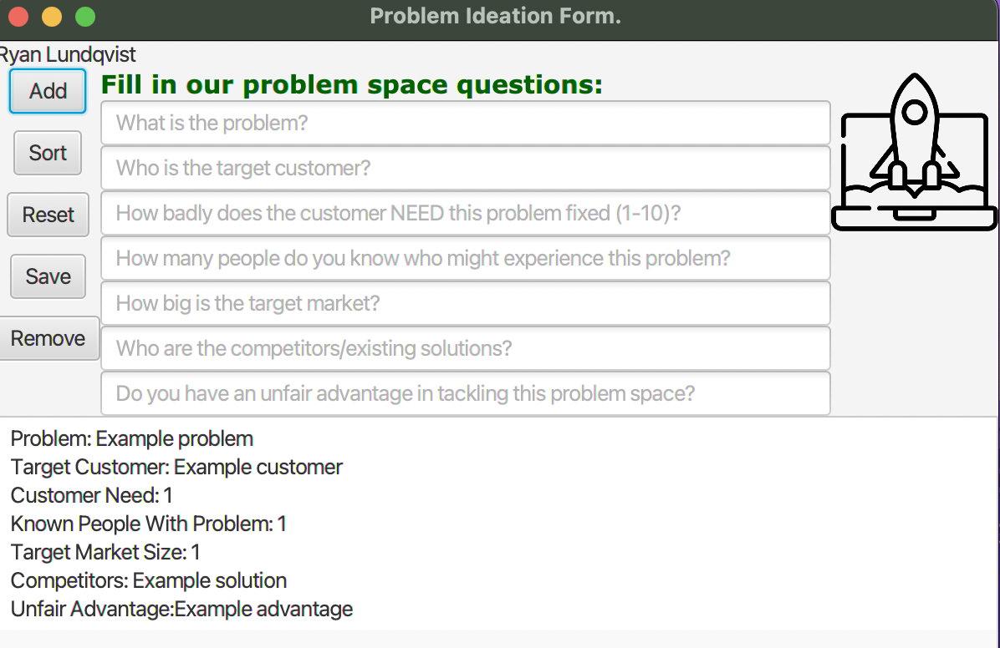

# startup-fun
A simple application built playing around with JavaFX, to track and log startup ideas with JavaFX event handling.

I built this to get a bit more comfortable with user interface design and using JavaFX. The StarterUpper file is the home of the JavaFX application, making use of the util file, a StartUpIdea class, and a few resources (audio sound effects and images). The application works by taking in a StartUpIdea with the add button and sorting those ideas based on potential with the sort button. Additionally, using the save button a new file containing these ideas can be made, and using the reset file that new file is deleted and the list is cleared. The remove button prompts a pop-up for deleting a specific idea. Other errors also prompt their own pop-ups, and a few audio effects/fonts and the like are sprinkled into the application.
